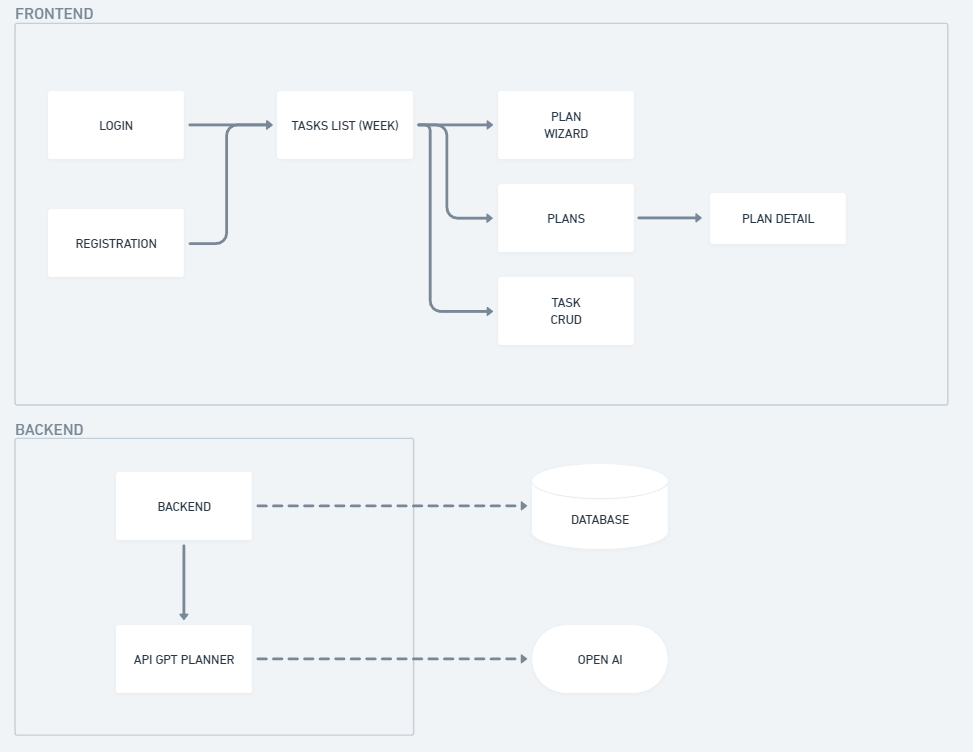

# AI-Planner
This project is a personal planner that uses AI to help the user create plans, manage personal projects and achieve their goals. Technologies used: Python, Django, Openai API. 

Video demo: <https://youtu.be/2KMw0e6QluY>

This is my final project for Harvard's CS50's Introduction to Computer Science course. I wanted to do something that used AI, and I was interested in making a personal planner, because it's something I would use. 
The AI Planner was built for the planning of complex, medium or long-term goals (e.g. a few months), but can also be used for shorter goals or as a regular planner. By providing information such as the objective of the plan, the due date and the number of hours that the user plans to dedicate weekly to this objective, the application creates a personalized plan with tasks to be performed to achieve the main goal. The tasks are divided into groups and can be edited to further customize the plan.

The todo app contains the funcionalities for create, view, update and delete the tasks. It also handles the authentication proccess with the register, login and logout functions.

The goals app deals with the creation and visualization of the plans. The utils file contains the function that handles assembling the prompt with variables passed by the user according to the goal of the plan and uses the Openai API to return the response generated by the AI. This information then is used to create the personalized plan with tasks for the user. The user can change the status of tasks as they complete them and progress towards fulfilling the plan.

## Examples

**User input**

* NAME: Trip to Rio de Janeiro
* OBJECTIVE: I want to plan a 10 day trip to Rio the Janeiro - Brazil for next 2 months. I want to go to the best beaches and visit the main tourist attractions and restaurants. I need to make a budget and save money for this trip.
* DUE DATE: 2024-02-01
* HOURS PER WEEK: 2

**AI Planner sample output:**

* **Budget Planning**
  * Research flight prices
    * Compare prices from different airlines and websites to find the best deals for flights to Rio de Janeiro.
    * Dec. 27, 2023
  * Research accommodation options
    * Explore different accommodation options in Rio de Janeiro, including hotels, hostels, and vacation rentals, to find the most suitable and cost-effective choice.
    * Jan. 2, 2024
  * Create a daily budget
    * Calculate the estimated costs for transportation, meals, attractions, and other expenses per day in Rio de Janeiro.
    * Jan. 4, 2024
* **Beach Exploration**
  * Research the top beaches in Rio de Janeiro
    * Gather information about the best beaches in Rio de Janeiro, including Copacabana, Ipanema, and Leblon, to plan visits accordingly.
    * Jan. 6, 2024
  * Plan beach visits
    * Create a schedule for visiting different beaches in Rio de Janeiro during the 10-day trip, considering factors such as location, safety, and popularity.
    * Jan. 7, 2024
* **Tourist Attractions**
  * Research main tourist attractions in Rio de Janeiro
    * Compile a list of must-visit attractions in Rio de Janeiro, such as Christ the Redeemer, Sugarloaf Mountain, and the Tijuca Forest.
    * Jan. 9, 2024
  * Create a detailed itinerary
    * Plan the daily activities and visits to the main tourist attractions in Rio de Janeiro, ensuring a balanced and enjoyable schedule.
    * Jan. 11, 2024
* **Restaurant Exploration**
  * Explore popular restaurants in Rio de Janeiro
    * Research and compile a list of highly recommended restaurants in Rio de Janeiro, considering different cuisines and budgets.
    * Jan. 13, 2024
  * Plan restaurant visits
    * Schedule visits to selected restaurants during the trip, ensuring a diverse dining experience in Rio de Janeiro.
    * Jan. 15, 2024
* **Finalize Budget and Savings**
  * Total up the estimated expenses
    * Calculate the total estimated expenses for the trip, including flights, accommodation, transportation, meals, and attractions.
    * Jan. 17, 2024
  * Create a savings plan
    * Determine how much money needs to be saved each month to cover the expenses of the trip by the desired date
    * Jan. 20, 2024

## Architecture

The system architecture is as follows:

